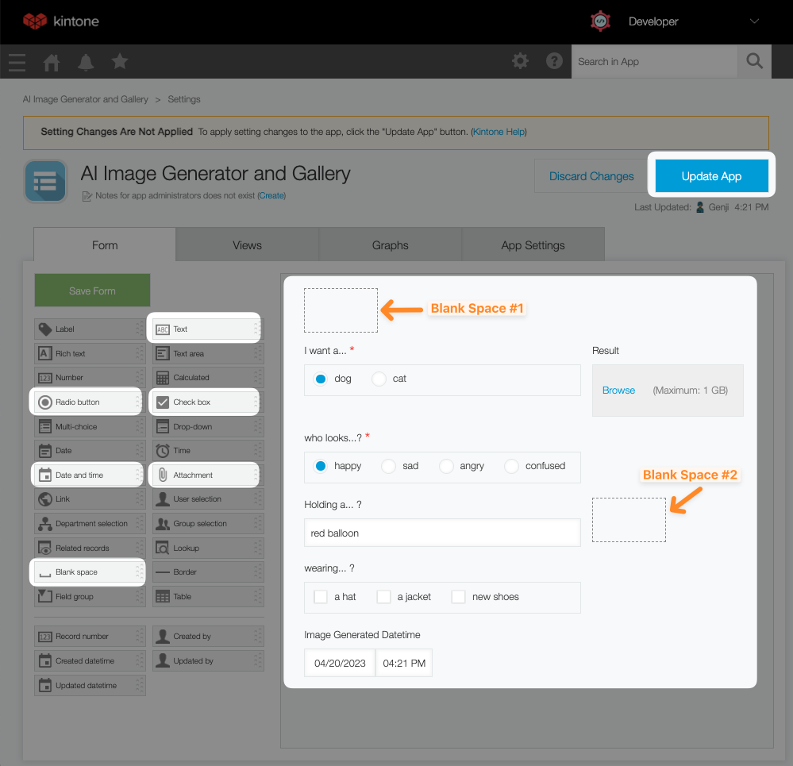
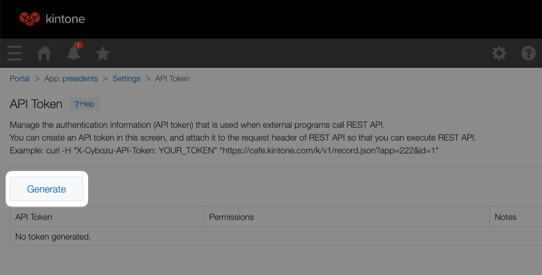
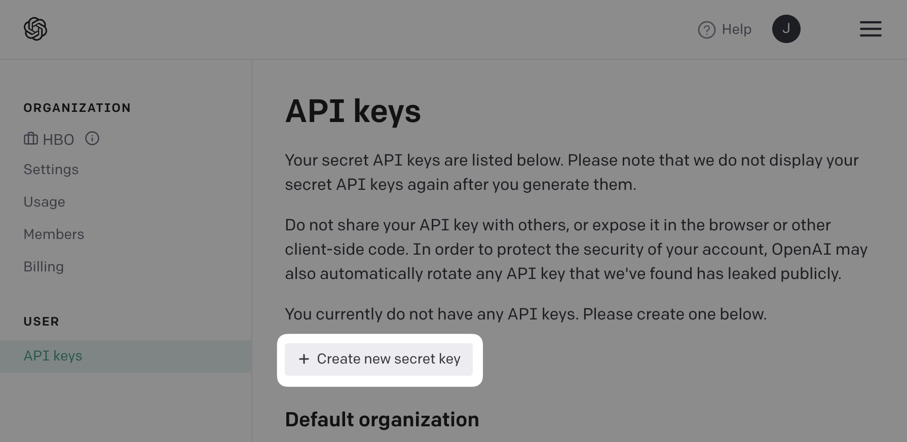

# OpenAI Art Generator & Gallery Workshop Steps

## Outline <!-- omit in toc -->
* [A. Get Started - Clone the Repo \& Install Dependencies](#a-get-started---clone-the-repo--install-dependencies)
* [B. Get Your Free Kintone Database](#b-get-your-free-kintone-database)
* [C. Create a `.env` file](#c-create-a-env-file)
* [D. Create a Kintone Web Database App](#d-create-a-kintone-web-database-app)
  * [Input Fields](#input-fields)
  * [Blank Space Fields](#blank-space-fields)
  * [Steps to Create the Kintone App](#steps-to-create-the-kintone-app)
* [E. Generate an API Token for Kintone App](#e-generate-an-api-token-for-kintone-app)
* [F. Edit Your customize-manifest.json](#f-edit-your-customize-manifestjson)
* [G. Create an OpenAI API Key](#g-create-an-openai-api-key)
* [H. Edit main.js](#h-edit-mainjs)
  * [Step 1: Make a prompt](#step-1-make-a-prompt)
  * [Step 2: Call our APIs](#step-2-call-our-apis)
* [I. Compile and upload the code to Kintone](#i-compile-and-upload-the-code-to-kintone)
* [J. Add a record to the Kintone App to generate an image](#j-add-a-record-to-the-kintone-app-to-generate-an-image)
* [Check Your Work](#check-your-work)
* [Still got a problem?](#still-got-a-problem)

## A. Get started - clone the repo & install dependencies

First, clone the [kintone-workshops/ai-kintone-gallery](https://github.com/kintone-workshops/ai-kintone-gallery) repo!  🚀  
Then go inside the folder & install the dependencies!

```shell
cd Downloads

git clone https://github.com/kintone-workshops/ai-kintone-gallery

cd ai-kintone-gallery

npm install

npm install -g @kintone/customize-uploader
```

## B. Get your free Kintone database

1. Go to [kintone.dev/new/](http://kintone.dev/new/) and fill out the form.  
   * ⚡ Only use lowercase, numbers, & hyphens in your subdomain
   * ⚠ Do not use uppercase or special characters
   * 🤖 Example subdomain: `example`
   * ✅ Use Chrome or Firefox
   * ❌ Do not use Safari
2. Look for "**Welcome to Kintone! One More Step for Developer License**" email in your inbox and click the **Activate Now** button.
   * Sent from `developer@kintone.com`
   * If you don't see it, check your spam folder
3. Set the **Initial Password**
4. Log into your Kintone Subdomain
   * URL: {your subdomain}.kintone.com (e.g. `example.kintone.com`)
   * Login Name: Your email address
   * Password: The password you set in Step 3
   * ⚡ If you forget your password, you can reset it by clicking the **Having Trouble Logging In?** link on the login screen.

|                                                                                              |                                                                                                                |
| -------------------------------------------------------------------------------------------- | -------------------------------------------------------------------------------------------------------------- |
|          |  |
|  |                                                               |

## C. Create a `.env` file

Duplicate the [.env.example](./../.env.example) file and save as `.env` file.  
This is where we will be saving the login credentials and API Keys.

Here is what your `.env` might look like:

```txt
KINTONE_BASE_URL="https://example.kintone.com"
KINTONE_USERNAME="MyEmail@example.com"
KINTONE_PASSWORD="ILoveKintone!"
VITE_KINTONE_SUBDOMAIN="example"
VITE_KINTONE_TOKEN="abcd2ef3g3hij2kl1"
VITE_KINTONE_APPID="1"
VITE_OPEN_AI_TOKEN="1234567890"
```

So far you can fill out the following variables:
* `KINTONE_BASE_URL`
* `KINTONE_USERNAME`
* `KINTONE_PASSWORD`
* `VITE_KINTONE_SUBDOMAIN`

### ⚠️ WARNING ⚠️ <!-- omit in toc -->

⚠️ DO NOT DELETE THE [.env.example](./../.env.example) FILE!  
[.env.example](./../.env.example) is used by env-cmd to verify that the `.env` file is correctly configured.

## D. Create a Kintone web database app

Let's create an **AI Image Generator and Gallery** Kintone App!  
This is where you will generate and store images generated using OpenAI's DALL·E 2.

Here are the required fields & their configurations for our workshop:

### Input Fields

| Field Type      | Field Name                   | Field Code | Note                                                             |
| --------------- | ---------------------------- | ---------- | ---------------------------------------------------------------- |
| Radio button #1 | **I want a...**              | `animal`   | Options: `dog` & `cat`                                           |
| Radio button #2 | **who looks...?**            | `emotion`  | Options: `happy`, `sad`, `angry`, & `confused`                   |
| Text            | **Holding a...**             | `random`   |                                                                  |
| Check Box       | **wearing... ?**             | `clothes`  | Options: `a hat`, `a jacket`, `new shoes`                        |
| Date and Time   | **Image Generated Datetime** | `dateTime` | Check the `Default to the record creation date and time.` box    |
| Attachment      | **Result**                   | `result`   | Where the image generated by OpenAI's DALL·E 2 will be displayed |

### Blank Space fields

| Field Type | Element ID       | Note                                                            |
| ---------- | ---------------- | --------------------------------------------------------------- |
| Space #1   | `generateButton` | Where the **Generate Images** button will be displayed          |
| Space #2   | `spinner`        | Where the Spinner will be displayed as the image gets generated |

### Steps To create the Kintone app

To create the Kintone App, click on the **➕** button on the upper right side of the Kintone Portal.
* 

Once you have configured the fields, the Kintone App should look like this:  


Then, click the **Save** and **Activate App** buttons! 💪

_Confused? 🤔 → Check out the [How to Create a Kintone Database App](https://youtu.be/pRtfn-8cf_I) video 📺_

## E. Generate an API token for Kintone app

We need to generate an API Token for our Kintone App.

1. From the Kintone App, click the **App Settings** button ⚙️ on the upper right side.
   * 
1. Select the **App Settings** tab
1. Under **Customization and Integration**, click the **API Token** button.
1. Click **Generate**. 
1. Check the `Add records` and `Edit records` boxes.  
   * 
1. Copy the API Token and past it to the `VITE_KINTONE_TOKEN` variable in your `.env` file.
1. Click the **Save** button on the bottom right side of the screen.
1. Click the **Update App** button on the upper right side of the screen.

## F. Edit your customize-manifest.json

Next, we need to tell our uploading scripts which Kintone App we will be working on.

Open your [customize-manifest.json](../customize-manifest.json). It will look like this:

```json
{
    "app": "1",
    "scope": "ALL",
    "desktop": {
        "js": ["dist/KintoneCustomization.umd.js"],
        "css": ["dist/style.css"]
    },
    "mobile": {
        "js": [],
        "css": []
    }
}
```

If this is NOT your first Kintone App, then you need to update the `"app"` variable with your App ID!

The App ID number can be easily found in the Kintone App's URL!

Go to the Kintone App and grab the URL.  
* Example: `https://devevents.kintone.com/k/52/`

Kintone App's URL follows this template:  
* `https://<SUBDOMAIN>.kintone.com/k/<App ID>/show#record=<RECORD ID>`

So then the `https://devevents.kintone.com/k/52/` URL tells us that this App's ID is `52`


### Update the `.env` file with the App ID as well! <!-- omit in toc -->
Input the App ID into the `VITE_KINTONE_APPID` variable in your `.env` file.

## G. Create an OpenAI API key

Head to [platform.openai.com/account/api-keys](https://platform.openai.com/account/api-keys) to access OpenAI's API Key settings page.

Then click the `Create new secret key` button to generate a new API Key.



Copy the API Key and paste it into your `.env` file.  
Paste your API Key from OpenAI into the `VITE_OPEN_AI_TOKEN` variable in your `.env` file.

---

## H. Edit main.js

For this workshop, we will only be coding in [./src/main.js](../src/main.js).

We have two steps:  
1. Format our data into a nice string to send to DALL-E.
2. Send that data to DALL-E, get an image back, then upload it to our Kintone gallery.

We have set up the [Open AI POST request](../src/requests/aiPOSTRequest.js) and our [Kintone PUT request](../src/requests/kintonePUTRequest.js), but need to understand what those functions need in order to work.

Looking at the [Open AI POST request](../src/requests/aiPOSTRequest.js), we can see it takes a `postBody` variable, to send to Open AI DALL-E. [Open AI's Image Generation](https://platform.openai.com/docs/api-reference/images/create) documentation says our `postBody` should look like this:

``` json
{
  "prompt": "A cute baby sea otter", // prompt
  "n": 2, // number of images to generate
  "size": "1024x1024", // resolution
  "response_format": "b64_json" // Either URL for a link, or b64_json for the raw image data
}
```

For this workshop, the size and number of images can be hand typed. We'll just generate one image for now. We want the raw image data so we can process it into an uploadable file.

Next, our [Kintone PUT request](../src/requests/kintonePUTRequest.js), takes in three variables to upload to Kintone:

```js
export default async function updateKintone(recordID, image, dateTime) {
   ...
```

A `recordID`, an `image` file, and the `dateTime` it was created at. Let's get started.

### Step 1: Make a prompt
Therefore, we need to create a prompt from our Kintone record data. On line 16 we'll fill in the prompt builder function. We have access to our Kintone variables like so: `event.record.FIELD_CODE.value`. We set up our field codes earlier with values like
* animal
* emotion
* random
* clothes
  so let's build a string with them. We can use *template literals*, aka *string interpolation*. We need to use backticks, ``` ` ``` and inject our variables using `${VARIABLE}`in order to do this.
```js
    const promptBuilder = () => {
      let promptString = `A cute ${event.record.animal.value} who looks ${event.record.emotion.value} holding a ${event.record.random.value} wearing `;
...
```

This works for our simple values, but we tried to be fancy with our clothes selector, and allowed for multiple or no choices. Since we have multiple values, we'll need to loop through them and add them to our string as needed.

```js
    const promptBuilder = () => {
      let promptString = `A cute ${event.record.animal.value} who looks ${event.record.emotion.value} holding a ${event.record.random.value} wearing `;

      let clothesArray = event.record.clothes.value;
      clothesArray.forEach((option, index) => {
        if (index == 0) {
          promptString += `${option}`;
        } else {
          promptString = promptString + ` and ${option}`;
        }
      });
      return promptString
    }
```

All this to create a fancy prompt for Open AI to process!

### Step 2: Call our APIs

Our code is setup to create a clickable button in our Kintone record. When we click the button, we want to send our prompt to DALL-E API, get the response, then upload that to Kintone. All in one click.
On line 74, we have the onClick function:

```js
    generateButton.onclick = () => {
      // Start the spinner.
      var spinner = new Spinner(opts).spin();
      spinnerTarget.appendChild(spinner.el);
      // We need to call our API POST function with request's body... 🧐
      generateImages(postBody).then(async (result) => {
```

We pass our `postBody` we made above into the generateImages function. We want this function to _wait_ for the response before trying to upload it to Kintone, so we make an async function, then with the result of that function, we'll prepare to upload to Kintone. We want to upload the file, and also the date-time it was created.

The Open AI API documentation shows the return values from our API call `result`:

```json
{
  "created": 1589478378, // a unix timestamp
  "data": [
    {
      "b64_json": "YWJjMT..." //our image in base64 format
    }
  ]
}
```

Let's format that unix timestamp to a user locale based date time:

```js
    generateButton.onclick = () => {
      // Start the spinner.
      var spinner = new Spinner(opts).spin();
      spinnerTarget.appendChild(spinner.el);
      // We need to call our API POST function with request's body... 🧐
      generateImages(postBody).then(async (result) => {
        const unixTimestamp = result.created;
        const date = new Date(unixTimestamp * 1000); // multiply by 1000 to convert to milliseconds
        const isoDateString = date.toISOString(); // Automatically manages timezone and daylight savings time!
```

Next, we have to convert our raw base64 image data to an image file to upload to Kintone. We provided a handy function on line 15, `b64toBlob(base64, type)` which will do the heavy lifting for us. Let's pass our base64 data into it, and convert that blob to a file object:

```js
    generateButton.onclick = () => {
      // Start the spinner.
      var spinner = new Spinner(opts).spin();
      spinnerTarget.appendChild(spinner.el);
      // We need to call our API POST function with request's body... 🧐
      generateImages(postBody).then(async (result) => {
        const unixTimestamp = result.created;
        const date = new Date(unixTimestamp * 1000); // multiply by 1000 to convert to milliseconds
        const isoDateString = date.toISOString(); // Automatically manages timezone and daylight savings time!
        // We convert the base64 to a blob.
        let imageBlob = await b64toBlob(result.data[0].b64_json)
        // And designate it as a file.
        let file = new File([imageBlob], "test.png", { type: 'image/png', lastModified: isoDateString })
```

Finally we have our dateTime and our image file, so let's save to our database for viewing later. We'll be calling the [Kintone PUT request](../src/requests/kintonePUTRequest.js) function, and like we explained in the beginning, giving it our `recordID` to update, the `isoDateString`, and our image `file`.

```js
    generateButton.onclick = () => {
      // Start the spinner.
      var spinner = new Spinner(opts).spin();
      spinnerTarget.appendChild(spinner.el);
      // We need to call our API POST function with request's body... 🧐
      generateImages(postBody).then(async (result) => {
        const unixTimestamp = result.created;
        const date = new Date(unixTimestamp * 1000); // multiply by 1000 to convert to milliseconds
        const isoDateString = date.toISOString(); // Automatically manages timezone and daylight savings time!
        // We convert the base64 to a blob.
        let imageBlob = await b64toBlob(result.data[0].b64_json)
        // And designate it as a file.
        let file = new File([imageBlob], "test.png", { type: 'image/png', lastModified: isoDateString })
        await updateKintone(event.recordId, file, isoDateString)
      }).finally(() => {
        // When the async api call is finished, reload the page to see our new image.
        window.location.reload();
      })
    };
```

At the end, we wait for the upload to finish, and reload the window, to immediately view our beautiful (maybe?) AI art.

---

## I. Compile and upload the code to Kintone

Save your work and build your code by entering `npm run build` in your terminal!
Then upload your code to Kintone by entering `npm run upload` in your terminal!

## J. Add a record to the Kintone app to generate an image

1. Go to your Kintone App and add a record by clicking the **➕** button on the upper right side of the screen.
1. Fill out the fields and save the record by clicking the **Save** button on the bottom left side of the screen.
1. Once the record is saved, the **Generate Images** button will be displayed (where the **Space** field was placed).
1. Click the **Generate Images** button to generate an image!
1. A spinner will appear and the page will refresh automatically when the image is generated.

Congrats! You have successfully generated an image using OpenAI's DALL·E 2!  
_Enjoy your new image of a dog/cat with a 5th paw ~_ 🐶🐱

## Check your work

Is your code not working?

Compare your [./src/main.js](../src/main.js) with the [Solution.md](./Solution.md) to see if it is all written correctly.

## Still got a problem?

Check out README's [Debugging](../README.md#debugging---lets-fix-those-problems) section!

And finally, post your Kintone customization questions over at our community forum:  
[forum.kintone.dev](https://forum.kintone.dev/)

Good luck coding! 💪
